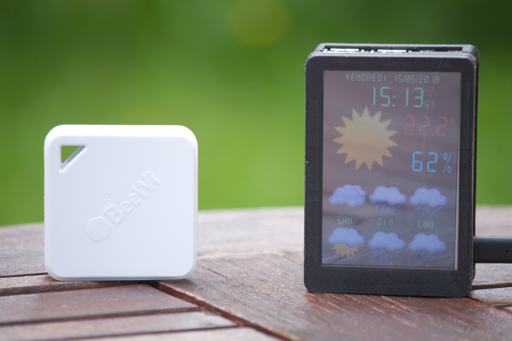

# Rpi Meteo
Transform your Raspverry Pi into a Weather station.

## Materials
- Raspberry Pi 2/3/4 model B
- 3.5inch display from [WaveShare](https://www.waveshare.com/)
- 2 beewi temperature & humidity sensor (BeeWi-BBW200)

Note: Any temperature & humidty sensor can be used but you need to create a script in order to get data and store it in DB

## OpenWeatherMap access
### API Key
Create and OpenWeatherMap account and get you API Key https://home.openweathermap.org/users/sign_up

### Location code
Download the city list and retreive you city code:
```
wget http://bulk.openweathermap.org/sample/city.list.json.gz
gunzip city.list.json.gz
vi city.list.json
```
### Test your access
You can now test your access thank to the URL:
http://api.openweathermap.org/data/2.5/forecast?id=CITY_CODE&APPID=API_KEY&units=metric

## BeeWi-BBW200 access
### Bluetooth addres
Get Bluetooth addresses of your two sensors with the following commands:
```
bluetoothctl
[NEW] Controller XX:XX:XX:XX:XX:XX my-linux [default]
[bluetooth]# scan on
Discovery started
[CHG] Controller XX:XX:XX:XX:XX:XX Discovering: yes
[NEW] Device F0:C7:00:00:00:00 BeeWi SmartClim
[bluetooth]# exit
```
In the example the address to get is __F0:C7:00:00:00:00__

## Softwares

Install pre-requisites:

Connect your Raspberry pi as `pi` user (ie: home directory `/home/pi`)

```
sudo apt-get install libsdl2-image-2.0-0 libsdl2-ttf-2.0-0 mariadb-server mariadb-client

sudo pip3 install pexpect nose pygatt mariadb

python3 -m pip install -U pygame --user

```


Install rpi-meteo:
```
git clone https://github.com/colas-sebastien/rpi-meteo.git
```